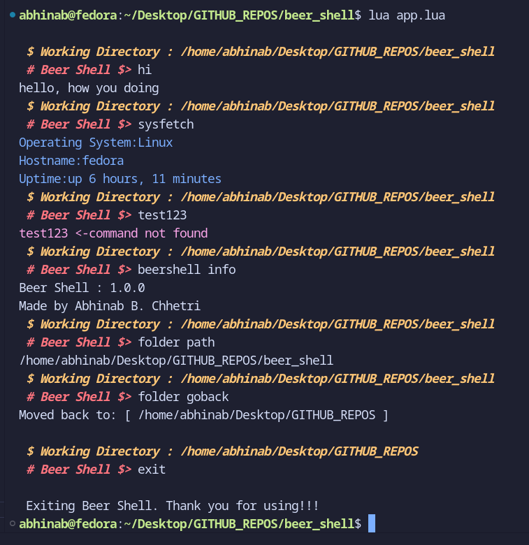

# Beer Shell [1.0.0] 

<table>
  <tr>
    <td></td>
    <td>A cool, user-friendly, and easy-to-use shell with niche features for Linux systems. Written entirely in Lua with zero dependencies, Beer Shell is a lightweight and fun alternative for your command line. (for now it is under development and has mminimal functionality) **idea is even a drunk person should be able to use it **</td>
  </tr>
</table>

Beer Shell is a unique command-line interface crafted for Linux enthusiasts. While its current functionality is more focused on aesthetics and simplicity than powerful scripting (like in `bash` or `PowerShell`), it's designed to be a delightful and intuitive experience.

It currently features over 80 useful commands to help automate things and has been tested on Ubuntu and Arch Linux.

### Key Information
- **Language:** Lua (no dependencies)
- **Compatibility:** Linux Systems Only ‼️
- **Core Idea:** A user-friendly, cool-looking shell with niche features.
- **Project Status:** In development, functionality is currently limited.

*(It's pretty easy to make your own shell, highly recommend you to try it yourself!)*

---

## 📸 In Action

Here's a look at Beer Shell running in a terminal.

---
# Shell Commands

  | Command          | Arguments | Type     | Description                        |
  |------------------|-----------|----------|------------------------------------|
  | **hi**           |           | Basic    | Prints a greeting message.         |
  | **sysfetch**     |           | Basic    | Runs system fetch command.         |
  | **clc**          |           | Basic    | Clears the terminal screen.        |
  | **exit**         |           | Basic    | Exits the shell/program.           |
  | **beer info**    |           | beer     | Shows Beer Shell info and author.  |
  | **beer version** |           | beer     | Shows Beer Shell version number.   |
  | **folder path**  |           | Folder   | Prints current working directory.  |
  | **folder goback**|           | Folder   | Goes back one folder level.        |

### Prerequisites
Before you begin, ensure you have Lua installed on your LINUX system.

